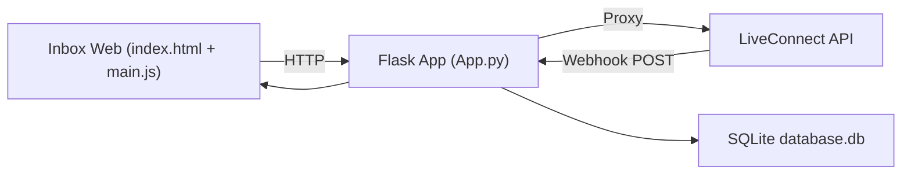

# Deep Wiki — Pruebas‑LiveConnect‑Proxy

## Resumen ejecutivo
Repositorio de pruebas internas para métodos API de LiveConnect. Implementa un backend Flask que sirve una interfaz web tipo “Inbox” y actúa como proxy hacia la API `https://api.liveconnect.chat`, además de recibir webhooks y persistir conversaciones/mensajes en SQLite. Está diseñado para uso interno (maneja credenciales sensibles).

## Estructura del repositorio
- `README.md`
  Descripción general y advertencia de uso interno.
- `Pruebas LC/Messaging_platform/App.py`
  Servidor Flask y rutas HTTP.
- `Pruebas LC/Messaging_platform/metodos/`
  Wrappers para endpoints LiveConnect (token, envío de mensajes, webhooks, balance, transferencias).
- `Pruebas LC/Messaging_platform/Inbox/`
  Lectura de conversaciones/mensajes desde SQLite.
- `Pruebas LC/Messaging_platform/DB/database.py`
  Inicialización y acceso a la base SQLite.
- `Pruebas LC/Messaging_platform/templates/index.html`
  UI principal (Inbox web).
- `Pruebas LC/Messaging_platform/static/main.js`
  Lógica del frontend (fetch a endpoints).
- `Pruebas LC/Messaging_platform/database.db`
  Base SQLite con `conversations` y `messages`.

## Arquitectura y flujo de datos

### Flujos principales
1. Inbox UI consulta `/conversations` y `/messages/<id>` para renderizar.
2. Acciones del usuario (sendMessage, sendQuickAnswer, transfer, balance) llaman al backend Flask, que a su vez proxy hacia LiveConnect usando `PageGearToken`.
3. Webhooks entran por `/webhook/liveconnect` y se persisten en SQLite.

## Backend (Flask)
Archivo: `Pruebas LC/Messaging_platform/App.py`

### Rutas
- `GET /`
  Render de `index.html`.
- `GET /conversations`
  Lista conversaciones desde SQLite.
- `GET /messages/<conversation_id>`
  Lista mensajes de conversación.
- `POST /webhook/liveconnect`
  Inserta conversación y mensaje en SQLite.
- `POST /setWebhook`
  Proxy a LiveConnect: set webhook.
- `POST /getWebhook`
  Proxy a LiveConnect: get webhook.
- `POST /sendMessage`
  Proxy a LiveConnect.
- `POST /sendQuickAnswer`
  Proxy a LiveConnect.
- `POST /sendFile`
  Proxy a LiveConnect.
- `POST /transfer`
  Proxy a LiveConnect.
- `GET /balance`
  Proxy a LiveConnect.

### Puntos clave
- `init_db()` se ejecuta al importar el módulo, creando tablas si no existen.
- La app corre en puerto `3000` (`app.run(port=3000)`).

## Persistencia (SQLite)
Archivo: `Pruebas LC/Messaging_platform/DB/database.py`

### Tablas
`conversations`
- `id` (TEXT, PK)
- `canal` (TEXT)
- `updated_at` (DATETIME, default CURRENT_TIMESTAMP)

`messages`
- `id` (INTEGER, PK AUTOINCREMENT)
- `conversation_id` (TEXT)
- `sender` (TEXT)
- `message` (TEXT)
- `created_at` (DATETIME, default CURRENT_TIMESTAMP)

### Notas de comportamiento
- En el webhook se inserta `sender = "usuario"` siempre.
- `updated_at` no se actualiza en nuevos mensajes; solo se setea al crear conversación.

## Módulos `metodos/` (proxy LiveConnect)
Archivo clave: `Pruebas LC/Messaging_platform/metodos/Token.py`

- Token caching global con expiración 8 horas (menos 1 minuto).
- Credenciales hardcodeadas (`KEY`, `SECRET`) dentro del repo. Esto es sensible y justifica el uso interno.

### Wrappers disponibles
- `send_message(data)` → `/prod/proxy/sendMessage`
- `send_quick_answer(data)` → `/prod/proxy/sendQuickAnswer`
- `send_file(data)` → `/prod/proxy/sendFile`
- `transfer(data)` → `/prod/proxy/transfer`
- `get_balance()` → `/prod/proxy/balance`
- `set_webhook(data)` → `/prod/proxy/setWebhook`
- `get_webhook(id_canal)` → `/prod/proxy/getWebhook`

Todos usan `PageGearToken` en headers.

## Inbox Web (UI)
Archivos:
- `Pruebas LC/Messaging_platform/templates/index.html`
- `Pruebas LC/Messaging_platform/static/main.js`

### Funcionalidades
- Sidebar con conversaciones (recarga cada 5s).
- Chat central con mensajes.
- Acciones rápidas:
  - `Saldo` → `/balance`
  - `QuickAnswer` → `/sendQuickAnswer` con `id_respuesta` fijo
  - `Transferir` → `/transfer` con `id_canal` fijo

### Observación clave
- Al enviar `sendMessage`, no se inserta en SQLite, por lo que la conversación solo refleja mensajes entrantes (webhook), no los salientes, a menos que LiveConnect los devuelva vía webhook.

## Uso básico (manual)
Desde `Pruebas LC/Messaging_platform/`:

1. Crear entorno virtual y activar.
2. Instalar deps: `Flask`, `requests`, `Flask-SQLAlchemy`.
3. Ejecutar `App.py`.
4. Abrir `http://localhost:3000/`.

Nota: `requirements.txt` contiene una línea que parece un comando (`python3 -m pip install -r requirements.txt`). Si se usa pip, esa línea puede fallar. Lo correcto es que el archivo tenga solo paquetes.

## Seguridad y consideraciones internas
- Las credenciales (`KEY`, `SECRET`) están embebidas en `metodos/Token.py`.
- Se almacenan mensajes y datos en `database.db` local.
- El README advierte que es exclusivo para equipos internos.

## Limitaciones conocidas / riesgos
- `updated_at` no se actualiza en nuevos mensajes → orden de conversaciones puede quedar obsoleto.
- Los mensajes enviados por el agente no se guardan localmente (solo webhook).
- La UI depende de `id_canal` y `id_respuesta` hardcodeados en `main.js`.
- `requirements.txt` no es estándar.

## Mapa de endpoints (inputs esperados)
Basado en `main.js` y `App.py`:

- `/sendMessage`
  Body: `{ id_conversacion, mensaje }`
- `/sendQuickAnswer`
  Body: `{ id_conversacion, id_respuesta, variables: {...} }`
- `/transfer`
  Body: `{ id_conversacion, id_canal, estado, mensaje }`
- `/getWebhook`
  Body: `{ id_canal }`
- `/setWebhook`
  Body: según API LiveConnect
- `/webhook/liveconnect`
  Body: `{ id_conversacion, mensaje, canal }` (mínimo)
